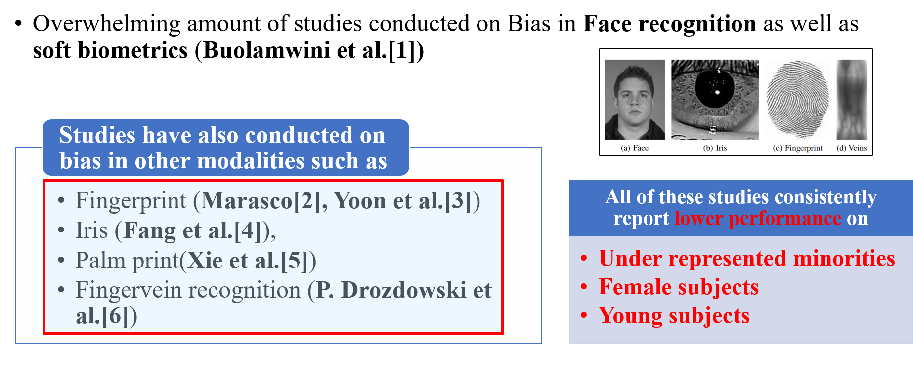
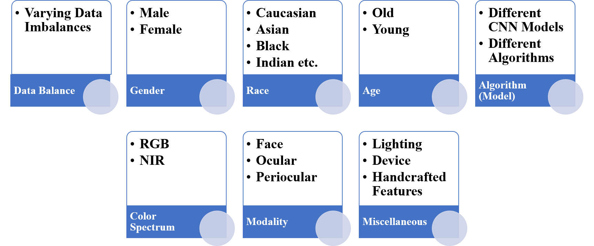

This page features condensed results of all the analysis that was done.

# Introduction

## Fairness evaluation studies across Biometric Modalities

## Fairness in Face Recognition

## Ocular : Motivation

## Research Objectives

## Covariates to be Studied

## Datasets Used

# Gender Classification

## Updates to Training

## Across Model - VIS

## Across Model - NIR

## Across Model - NIR (Cross Dataset)

## Across Databalance - VIS

## Across Databalance - NIR

## Across Race - VIS

## Across Age - VIS

## Across Modality - VIS

## Across Modality - NIR

## Across Device - VIS

## Across Lighting - VIS

## Across Spectrum 

# Subject Verification

## Across Model - VIS

## Across Model - NIR

## Across Databalance - VIS

## Across Databalance - NIR 

## Across Race - VIS

## Across Modality - VIS

## Across Modality - NIR

## Across Device - VIS

## Across Lighting - VIS  

## Across Spectrum

# Summary

