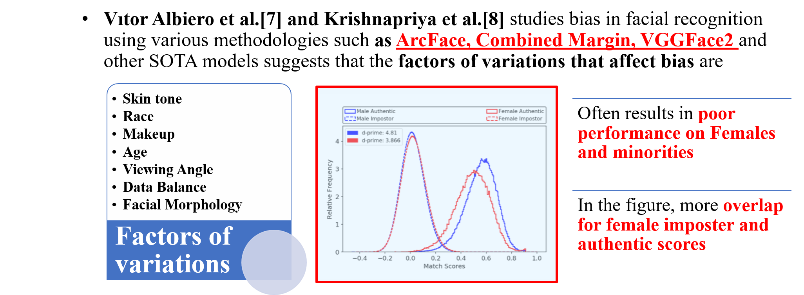

# Introduction

## Fairness evaluation studies across Biometric Modalities

## Fairness in Face Recognition

## Ocular : Motivation

## Research Objectives

## Covariates to be Studied

## Datasets Used

# Gender Classification

## Across Models
### Across Models on UFPR Periocular - RGB

### Across Models on Notredame Ocular - NIR

## Across Varying Data Balances and Gender
### UFPR - RGB

### Notredame - NIR

## Across Age
### UFPR - RGB
 
<table class="table text-center table-mod">
<caption class="text-center">TABLE I: Accuracy of CNN-based Gender Classification on Left Ocular Region among Young (18 to 39 years), Middle (40
to 59 years) and Older Adults (60 to 79 years).
</caption>
<thead>
  <tr>
    <th class="tg-amwm">CNN</th>
    <th class="tg-amwm" colspan="2">Young</th>
    <th class="tg-amwm" colspan="2">Middle-Aged</th>
    <th class="tg-amwm" colspan="2">Older</th>
  </tr>
</thead>
<tbody>
  <tr>
    <td class="tg-amwm"></td>
    <td class="tg-amwm">Male[%]</td>
    <td class="tg-amwm">Female[%]</td>
    <td class="tg-amwm">Male[%]</td>
    <td class="tg-amwm">Female[%]</td>
    <td class="tg-amwm">Male[%]</td>
    <td class="tg-amwm">Female[%]</td>
  </tr>
  <tr>
    <td class="tg-baqh">ResNet-50</td>
    <td class="tg-baqh">98.39</td>
    <td class="tg-baqh">98.19</td>
    <td class="tg-baqh">100</td>
    <td class="tg-baqh">96.67</td>
    <td class="tg-baqh">99.17</td>
    <td class="tg-baqh">98.06</td>
  </tr>
  <tr>
    <td class="tg-baqh">MobileNet-V2</td>
    <td class="tg-baqh">99.97</td>
    <td class="tg-baqh">99.9</td>
    <td class="tg-baqh">100</td>
    <td class="tg-baqh">99.7</td>
    <td class="tg-baqh">100</td>
    <td class="tg-baqh">100</td>
  </tr>
  <tr>
    <td class="tg-baqh">ShuffleNet-V2-50</td>
    <td class="tg-baqh">98.23</td>
    <td class="tg-baqh">97.57</td>
    <td class="tg-baqh">98.28</td>
    <td class="tg-baqh">97.56</td>
    <td class="tg-baqh">94.76</td>
    <td class="tg-baqh">98.89</td>
  </tr>
  <tr>
    <td class="tg-baqh">EfficientNet-B0</td>
    <td class="tg-baqh">95.89</td>
    <td class="tg-baqh">97.54</td>
    <td class="tg-baqh">98.58</td>
    <td class="tg-baqh">96.44</td>
    <td class="tg-baqh">95.23</td>
    <td class="tg-baqh">86.94</td>
  </tr>
</tbody>
</table>

 

## Across Race
### VISOB + Notredame- Ocular RGB

<table class="table text-center table-mod">
<caption class="text-center">TABLE II: Gender Classification results across race groups - Ocular Datasets.</caption>
<thead>
  <tr>
    <th class="tg-amwm">Race</th>
    <th class="tg-amwm">Male</th>
    <th class="tg-amwm">Female</th>
  </tr>
</thead>
<tbody>
  <tr>
    <td class="tg-baqh">White</td>
    <td class="tg-baqh">82.42</td>
    <td class="tg-baqh">89.92</td>
  </tr>
  <tr>
    <td class="tg-baqh">South Asian</td>
    <td class="tg-baqh">96.51</td>
    <td class="tg-baqh">88.88</td>
  </tr>
  <!-- <tr>
    <td class="tg-0lax">East Asian</td>
    <td class="tg-0lax">26.50</td>
    <td class="tg-0lax">72.72</td>
  </tr> -->
  <tr>
    <td class="tg-0lax">Black</td>
    <td class="tg-0lax">78.57</td>
    <td class="tg-0lax">72.10</td>
  </tr>
  <tr>
    <td class="tg-0lax">Middle Eastern</td>
    <td class="tg-0lax">71.12</td>
    <td class="tg-0lax">93.08</td>
  </tr>
  <tr>
    <td class="tg-0lax">Latino</td>
    <td class="tg-0lax">84.83</td>
    <td class="tg-0lax">91.61</td>
  </tr>
</tbody>
</table>

## Face VS Ocular
### FlickrFaceHQ-Aging - RGB

<table class="table text-center table-mod   ">
<caption class="text-center">TABLE III: Gender Classification results across Face vs Periocular on FFHQ-Aging.</caption>
<thead>
  <tr>
    <th class="tg-amwm">Male</th>
    <th class="tg-amwm">Female</th>
    <th class="tg-amwm">Modality</th>
  </tr>
</thead>
<tbody>
  <tr>
    <td class="tg-baqh">97.6</td>
    <td class="tg-baqh">96.8</td>
    <td class="tg-baqh">Face</td>
  </tr>
  <tr>
    <td class="tg-baqh">92.5</td>
    <td class="tg-baqh">91.6</td>
    <td class="tg-baqh">Ocular</td>
  </tr>
</tbody>
</table>

### Notredame - NIR
#### Face

#### Ocular

# Subject Verification

## Across Gender
### UFPR - RGB
#### Training Set : All

#### Training Set : Male

#### Training Set : Female

### Notredame - NIR
#### Training Set : All

#### Training Set : Male

#### Training Set : Female

### VISOB - RGB

## Across Varying Data Balances and Models
### UFPR - RGB

### Notredame - NIR

## Across Age
### UFPR - RGB
<table class="table text-center table-mod">
<caption class="text-center">TABLE I: EER and FNMR at 0.01 and 0.1 FMR for user authentication using CNN models for Left (L), Right (R) ocular region,and their score-level fusion (L+R) for Young, Middle-Aged and Older adults evaluated on balanced version of UFPR ocular datasets.</caption>
<thead>
  <tr>
    <th class="tg-9wq8" rowspan="3">CNN </th>
    <th class="tg-9wq8" rowspan="3">Age-Group </th>
    <th class="tg-9wq8" colspan="3" rowspan="2">EER(%)&nbsp;&nbsp;</th>
    <th class="tg-9wq8" colspan="6">FNMR(%) @ FMR</th>
  </tr>
  <tr>
    <th class="tg-kyy7" colspan="3">0.01</th>
    <th class="tg-kyy7" colspan="3">0.1</th>
  </tr>
  <tr>
    <th class="tg-c3ow">L</th>
    <th class="tg-c3ow">R</th>
    <th class="tg-c3ow">L+R</th>
    <th class="tg-c3ow">L</th>
    <th class="tg-c3ow">R</th>
    <th class="tg-c3ow">L+R</th>
    <th class="tg-c3ow">L</th>
    <th class="tg-c3ow">R</th>
    <th class="tg-c3ow">L+R</th>
  </tr>
</thead>
<tbody>
  <tr>
    <td class="tg-kyy7" rowspan="3">ResNet-50</td>
    <td class="tg-abip">Young</td>
    <td class="tg-abip">8.60</td>
    <td class="tg-abip">9.52</td>
    <td class="tg-abip">9.06</td>
    <td class="tg-abip">37.63</td>
    <td class="tg-abip">35.35</td>
    <td class="tg-abip">36.49</td>
    <td class="tg-abip">53.74</td>
    <td class="tg-abip">54.03</td>
    <td class="tg-abip">53.89</td>
  </tr>
  <tr>
    <td class="tg-c3ow">Middle-Aged</td>
    <td class="tg-c3ow">8.62</td>
    <td class="tg-c3ow">9.08</td>
    <td class="tg-c3ow">8.85</td>
    <td class="tg-c3ow">30.76</td>
    <td class="tg-c3ow">25.04</td>
    <td class="tg-c3ow">27.9</td>
    <td class="tg-c3ow">52.23</td>
    <td class="tg-c3ow">48.55</td>
    <td class="tg-c3ow">50.39</td>
  </tr>
  <tr>
    <td class="tg-abip">Older</td>
    <td class="tg-abip">11.01</td>
    <td class="tg-abip">11.00</td>
    <td class="tg-abip">11.01</td>
    <td class="tg-abip">15.47</td>
    <td class="tg-abip">19.34</td>
    <td class="tg-abip">17.405</td>
    <td class="tg-abip">30.67</td>
    <td class="tg-abip">30.67</td>
    <td class="tg-abip">30.67</td>
  </tr>
  <tr>
    <td class="tg-9wq8" rowspan="3">MobileNet-V2</td>
    <td class="tg-c3ow">Young</td>
    <td class="tg-c3ow">7.75</td>
    <td class="tg-c3ow">7.32</td>
    <td class="tg-c3ow">7.54</td>
    <td class="tg-c3ow">33.21</td>
    <td class="tg-c3ow">26.11</td>
    <td class="tg-c3ow">29.66</td>
    <td class="tg-c3ow">51.61</td>
    <td class="tg-c3ow">48.28</td>
    <td class="tg-c3ow">49.95</td>
  </tr>
  <tr>
    <td class="tg-abip">Middle-Aged</td>
    <td class="tg-abip">9.08</td>
    <td class="tg-abip">8.68</td>
    <td class="tg-abip">8.88</td>
    <td class="tg-abip">29.18</td>
    <td class="tg-abip">28.14</td>
    <td class="tg-abip">28.66</td>
    <td class="tg-abip">51.17</td>
    <td class="tg-abip">51.31</td>
    <td class="tg-abip">51.24</td>
  </tr>
  <tr>
    <td class="tg-c3ow">Older</td>
    <td class="tg-c3ow">8.04</td>
    <td class="tg-c3ow">9.63</td>
    <td class="tg-c3ow">8.84</td>
    <td class="tg-c3ow">18.54</td>
    <td class="tg-c3ow">13.47</td>
    <td class="tg-c3ow">16.005</td>
    <td class="tg-c3ow">39.47</td>
    <td class="tg-c3ow">36.00</td>
    <td class="tg-c3ow">37.74</td>
  </tr>
  <tr>
    <td class="tg-kyy7" rowspan="3">ShuffleNet-V2</td>
    <td class="tg-abip">Young</td>
    <td class="tg-abip">6.93</td>
    <td class="tg-abip">6.96</td>
    <td class="tg-abip">6.95</td>
    <td class="tg-abip">37.63</td>
    <td class="tg-abip">38.09</td>
    <td class="tg-abip">37.86</td>
    <td class="tg-abip">56.44</td>
    <td class="tg-abip">56.26</td>
    <td class="tg-abip">56.35</td>
  </tr>
  <tr>
    <td class="tg-c3ow">Middle-Aged</td>
    <td class="tg-c3ow">8.32</td>
    <td class="tg-c3ow">9.25</td>
    <td class="tg-c3ow">8.79</td>
    <td class="tg-c3ow">37.38</td>
    <td class="tg-c3ow">46.07</td>
    <td class="tg-c3ow">41.73</td>
    <td class="tg-c3ow">55.08</td>
    <td class="tg-c3ow">61.10</td>
    <td class="tg-c3ow">58.09</td>
  </tr>
  <tr>
    <td class="tg-abip">Older</td>
    <td class="tg-abip">9.72</td>
    <td class="tg-abip">8.18</td>
    <td class="tg-abip">8.95</td>
    <td class="tg-abip">30.53</td>
    <td class="tg-abip">30.80</td>
    <td class="tg-abip">30.67</td>
    <td class="tg-abip">44.93</td>
    <td class="tg-abip">53.47</td>
    <td class="tg-abip">49.20</td>
  </tr>
  <tr>
    <td class="tg-9wq8" rowspan="3">EfficientNet-B0</td>
    <td class="tg-c3ow">Young</td>
    <td class="tg-c3ow">7.64</td>
    <td class="tg-c3ow">9.61</td>
    <td class="tg-c3ow">8.63</td>
    <td class="tg-c3ow">32.54</td>
    <td class="tg-c3ow">27.00</td>
    <td class="tg-c3ow">29.77</td>
    <td class="tg-c3ow">55.40</td>
    <td class="tg-c3ow">48.38</td>
    <td class="tg-c3ow">51.89</td>
  </tr>
  <tr>
    <td class="tg-abip">Middle-Aged</td>
    <td class="tg-abip">6.95</td>
    <td class="tg-abip">9.03</td>
    <td class="tg-abip">7.99</td>
    <td class="tg-abip">38.07</td>
    <td class="tg-abip">26.69</td>
    <td class="tg-abip">32.38</td>
    <td class="tg-abip">49.12</td>
    <td class="tg-abip">49.31</td>
    <td class="tg-abip">49.22</td>
  </tr>
  <tr>
    <td class="tg-c3ow">Older</td>
    <td class="tg-c3ow">9.34</td>
    <td class="tg-c3ow">12.08</td>
    <td class="tg-c3ow">10.71</td>
    <td class="tg-c3ow">20.80</td>
    <td class="tg-c3ow">23.33</td>
    <td class="tg-c3ow">22.065</td>
    <td class="tg-c3ow">39.73</td>
    <td class="tg-c3ow">41.74</td>
    <td class="tg-c3ow">40.74</td>
  </tr>
</tbody>
</table>

